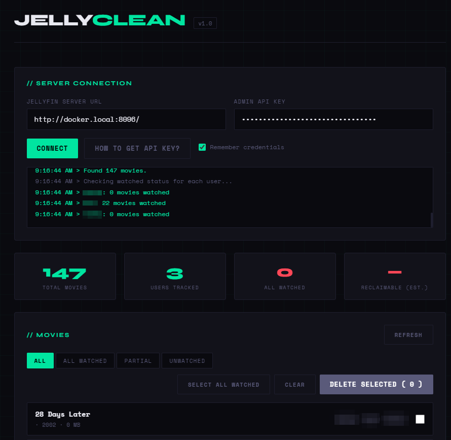

# JellyClean

Delete Jellyfin movies that all users have watched.

## Run

```bash
docker compose up -d
```
OR

```bash
services:
  jellyclean:
    image: incmve/jellyclean:latest
    container_name: jellyclean
    restart: unless-stopped
    ports:
      - "8099:80"
```


Open [http://localhost:8099](http://localhost:8099)


